# Práctica de Self-Hosting

Todo el trabajo realizado y el contenido de la práctica se encuentra aqui.

### Enlace al repositorio

https://github.com/ResetDeFabrica/self-hosting

# Archivo vagrant

```
# -*- mode: ruby -*-  
# vi: set ft=ruby :

# Configuración principal de Vagrant
Vagrant.configure("2") do |config|

  config.vm.box = "debian/bookworm64"

  # Se define la configuración para la máquina virtual "resetdefabrica"
  config.vm.define "resetdefabrica" do |resetdefabrica|

    # Configuración de red para la máquina virtual con una IP estática en la red privada
    resetdefabrica.vm.network "private_network", ip: "192.168.57.10"

    # Provisionamiento de la VM con un script shell
    resetdefabrica.vm.provision "shell", inline: <<-SHELL
    
    # Actualización de los repositorios y la instalación de paquetes necesarios
    apt update
    apt install -y git nginx openssl ufw docker.io curl apache2-utils

    # Configuración de reglas del firewall utilizando UFW (Uncomplicated Firewall)
    ufw allow ssh
    ufw allow 'Nginx Full'  # Permite el tráfico HTTP y HTTPS para nginx
    ufw allow 19999         # Permite el puerto 19999, utilizado para monitoreo (por ejemplo, Netdata)
    ufw delete allow 'Nginx HTTP'  # Elimina la regla 'Nginx HTTP' para evitar duplicados
    ufw --force enable       # Habilita el firewall con las reglas configuradas

    # Crea un directorio para alojar los archivos web
    mkdir -p /var/www/resetdefabrica/html

    # Establece permisos apropiados para los archivos del directorio web
    chown -R www-data:www-data /var/www/resetdefabrica/html
    chmod -R 755 /var/www/resetdefabrica

    # Copia la configuración de Nginx desde el directorio /vagrant al sistema
    cp /vagrant/resetdefabrica /etc/nginx/sites-available/resetdefabrica

    # Copia los archivos estáticos desde el directorio /vagrant/files al servidor web
    cp -r /vagrant/files/* /var/www/resetdefabrica/html

    # Generación de un certificado SSL autofirmado para Nginx
    openssl req -x509 -nodes -days 365 \
    -newkey rsa:2048 -keyout /etc/ssl/private/resetdefabrica.key \
    -out /etc/ssl/certs/resetdefabrica.crt \
    -subj "/C=ES/ST=Andalucía/L=Granada/O=IZV/OU=WEB/CN=resetdefabrica/emailAddress=webmaster@resetdefabrica.com"

    # Activa la configuración del sitio en Nginx creando un enlace simbólico
    ln -sf /etc/nginx/sites-available/resetdefabrica /etc/nginx/sites-enabled/resetdefabrica

    # Verificación de la configuración de Nginx
    nginx -t

    # Reinicia el servicio de Nginx para aplicar los cambios
    systemctl restart nginx

    # Instalación de ngrok para exponer servicios locales a Internet
    curl -sSL https://ngrok-agent.s3.amazonaws.com/ngrok.asc \
    | sudo tee /etc/apt/trusted.gpg.d/ngrok.asc >/dev/null \
    && echo "deb https://ngrok-agent.s3.amazonaws.com buster main" \
    | sudo tee /etc/apt/sources.list.d/ngrok.list \
    && sudo apt update \
    && sudo apt install ngrok

    # Configura ngrok con el token de autenticación
    ngrok config add-authtoken 2poHYU57PsYeftaJPTjBBKJNk8i_3E3drNDvHeVrgqJbsCTSA

    # Inicia ngrok en segundo plano para exponer el servicio HTTPS
    nohup ngrok http --url=oriented-supposedly-bunny.ngrok-free.app 443 &

    # Configura y ejecuta un contenedor Docker con Uptime Kuma para monitoreo
    docker run -d --restart=always -p 3001:3001 -v uptime-kuma:/app/data --name uptime-kuma louislam/uptime-kuma:1

    SHELL
  end
end

```

# Certificado de mi dominio


# Pagina de inicio

Dominio: https://oriented-supposedly-bunny.ngrok-free.app/


# Pagina de error personalizada

URL: https://oriented-supposedly-bunny.ngrok-free.app/error.html


# Descargar una imagen

Se produce al hacer click en el boton de la web principal y al poner la ruta

https://oriented-supposedly-bunny.ngrok-free.app/logo.jpg

# Administración

Vas a la sección admin con usuario y contraseña y a su html creado


# Status

Vas a la sección status con usuario y contraseña y a su html creado


## Instalación de Netdata

He instalado Netdata en mi máquina virtual con Vagrant y he configurado el acceso a través de Nginx.
No me iba Uptime Kuma, me meto y monitoreo pero cuando le doy a Status no me lleva a Uptime Kuma y opté por la opción más dificil de Netdata.


1. Vamos con Netdata

Me meto en la maquina virtual con vagrant ssh

Instalo curl si no lo tenía instalado antes:

```

sudo apt update
sudo apt install -y curl

```

ejecuto este comando para descargar e instalar NetData

```
curl -L https://my-netdata.io/kickstart.sh -o kickstart.sh 

```

con este comando y el -L se descarga correctamente el script

```
sudo bash kickstart.sh 

```
aquí ejecutas

Cuando hago la instalación me pide reiniciar ciertos servicios


Cuando se instala compruebo que corre correctamente

```
sudo systemctl status netdata

```

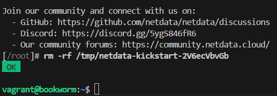


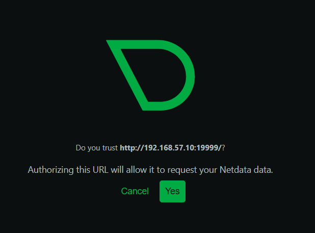

Se accede a NetData una vez lo compruebas que por defecto se pone en el puerto 19999

http://192.168.57.10:19999

Como no me dejaba entrar tuve que darle permiso al cortafuegos para que habilitara el puerto 19999

```
sudo ufw allow 19999

```

Ahora si entro en NetData correctamente

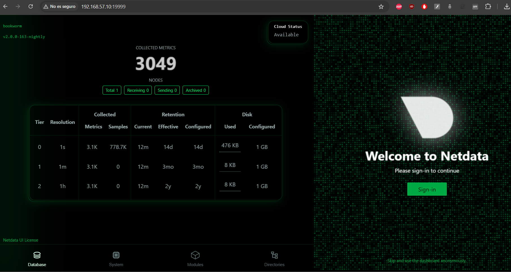

Ahora hay que redirigir desde mi ruta al dashboard de NetData para que puede monitorizar

```
location /status {
    auth_basic "Área restringida";
    auth_basic_user_file /etc/nginx/.htpasswd_status;
    
    proxy_pass http://127.0.0.1:19999; # Dirección local de NetData
    proxy_set_header Host $host;
    proxy_set_header X-Forwarded-Host $host;
    proxy_set_header X-Forwarded-For $proxy_add_x_forwarded_for;
    proxy_set_header X-Forwarded-Proto $scheme;
    proxy_buffering off; # Desactiva el buffering para NetData

}

```

Verifico que mi configuración no tenga errores de sintaxis

```
vagrant@bookworm:~$ sudo nginx -t
nginx: the configuration file /etc/nginx/nginx.conf syntax is ok
nginx: configuration file /etc/nginx/nginx.conf test is successful
vagrant@bookworm:~$
```


Me da errores y tengo que configurar archivos de netdata


Con este comando agrego la linea que me interesa y doy permisos a mi dominio

```
sudo nano /etc/netdata/netdata.conf

```

Escribo lo siguiente:

```
[web]
    allowed origins = https://oriented-supposedly-bunny.ngrok-free.app

```

Guardo con ctrl + O y Enter y ctrl + X para salir

Reinicio el servicio para que se apliquen los cambios

```
sudo systemctl restart netdata

```

Consigo entrar (ahora si) con mi correo/cuenta y me sale esto


Con el comando que me dice en consola, lo pongo 

```
sudo cat /var/lib/netdata/netdata_random_session_id

```

y me sale la siguiente private key

```

16a93818-cb33-4b25-ac58-7b84476d3846

```

Después de rellenar unas opciones me da una prueba de 14 días


Una vez dentro e investigando las métricas


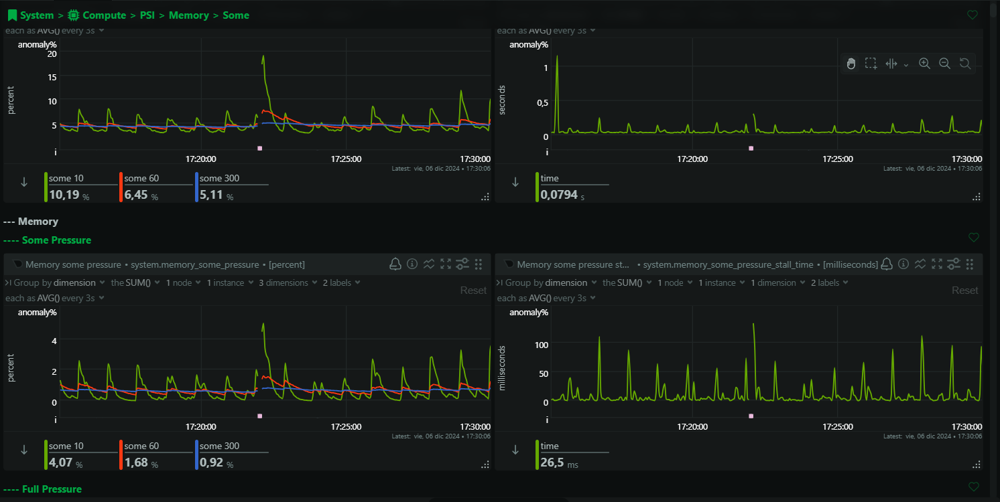

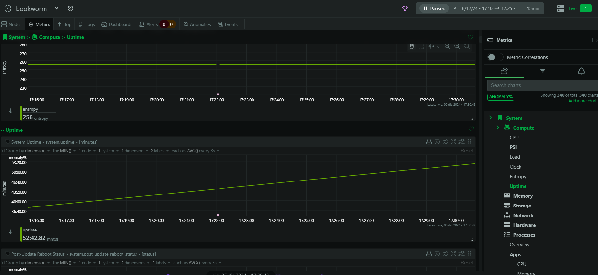


He intentado hacer una ruta desde Status.html para que se puedan ver las metrics de mi servidor


Me meto desde consola para modificar el archivo status.html para acabar con el diseño y hacerle un botón que al darle, te lleve a las métricas de NetData de mi sitioweb

```
sudo nano /var/www/resetdefabrica/html/status.html

```

Aquí cambio el HTML y lo guardo con ctrl + O y Enter y ctrl + X para salir

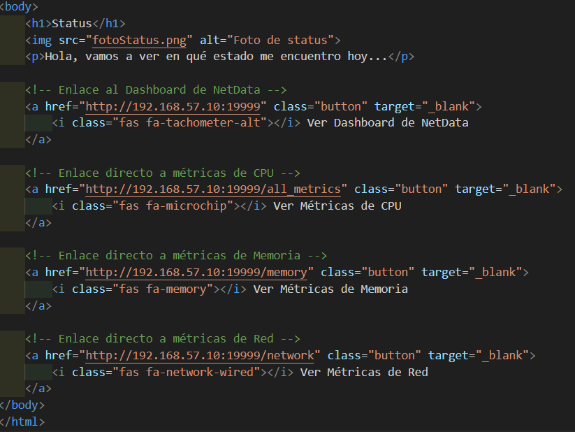

Finalmente pongo la primera ruta porque el resto no tienen sentido y no me sirven

Y ya por fin se puede ver el status con un botón desde mi ruta https://oriented-supposedly-bunny.ngrok-free.app/status

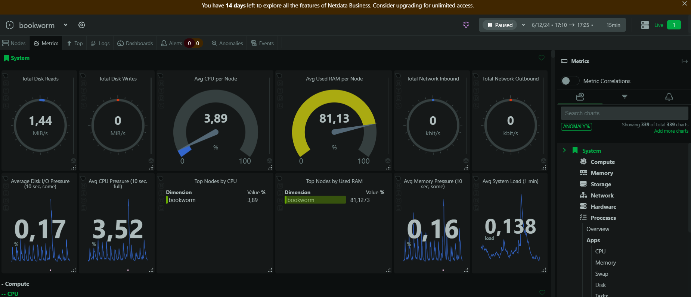

Tengo que hacerlo con IP porque con mi dominio ngrok me dice que tengo un túnel abierto y no me deja en la versión gratis tener varios túneles, por lo que le pongo a la ruta mi IP


# Verificación y Pruebas

## Pruebas localhost 1000 100 - 1000 1000 y 10000 1000

Hay que instalar apache2 para que funcionen las pruebas

```
sudo apt install apache2-utils

```

1. localhost 1000 100

con el comando

```
ab -n 1000 -c 100 -k -H "Accept-Encoding: gzip, deflate" https://localhost/

```

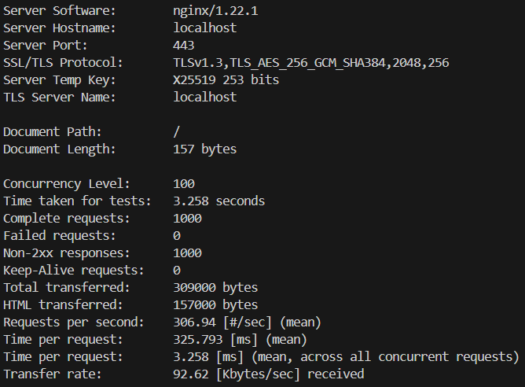


OPINION:

Los resultados de la prueba muestran un rendimiento razonable del servidor, con 100 usuarios concurrentes y 1000 peticiones completadas sin fallos, pero algunas áreas clave pueden mejorarse. El servidor maneja un promedio de 77.09 peticiones por segundo, lo cual es adecuado para tráfico moderado, pero el tiempo medio por solicitud es de 1.3 segundos, lo que podría mejorarse para una experiencia de usuario más ágil.

Un aspecto crítico es la latencia en las conexiones, con un tiempo promedio de 1168 ms, lo que indica que el servidor puede estar sufriendo por la infraestructura de red o la gestión de conexiones simultáneas. Además, la mayoría de las solicitudes se procesaron rápidamente (menos de 1 segundo para el 50%), pero algunas tardaron hasta 3.3 segundos, lo que sugiere posibles cuellos de botella en el servidor o en la red.

Para mejorar el rendimiento, se recomendaría optimizar la red y las conexiones (por ejemplo, con conexiones persistentes), revisar la configuración del servidor (Nginx) para manejar mejor las solicitudes concurrentes y considerar técnicas de compresión y caché más eficaces. En general, el servidor parece funcionar bien, pero los tiempos de respuesta y la latencia deben ser optimizados para mejorar la experiencia del usuario.


2. localhost 1000 1000

con el comando

```
ab -n 1000 -c 1000 -k -H "Accept-Encoding: gzip, deflate" https://localhost/

```


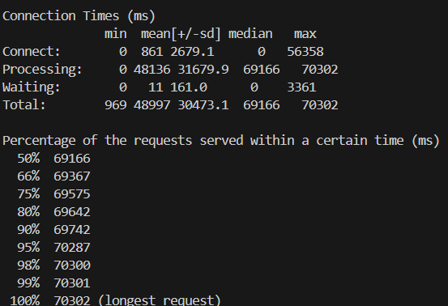

OPINION:

En esta prueba de rendimiento, el servidor ha manejado correctamente 1000 solicitudes concurrentes, completándolas todas sin fallos, lo cual es positivo. Sin embargo, los tiempos de respuesta son elevados, con un tiempo promedio por solicitud de 51.566 ms y tiempos de conexión y procesamiento bastante altos (26,153 ms y 1,812 ms respectivamente). Esto sugiere que el servidor podría estar sobrecargado o que no está gestionando eficientemente las conexiones.

La alta latencia podría deberse a cuellos de botella en el servidor, en la configuración de Nginx o en el procesamiento de solicitudes del backend, como las consultas a la base de datos. Las solicitudes más lentas (por ejemplo, en el 90% o 99% de los casos) muestran tiempos de respuesta excesivos, lo que refuerza la idea de que el servidor no es suficientemente rápido bajo carga.

Para mejorar, se recomienda optimizar la configuración de Nginx, revisar posibles cuellos de botella en el backend y considerar el uso de caché para mejorar el rendimiento. Además, si se esperan cargas altas regularmente, podría ser útil explorar opciones de escalabilidad. Aunque el servidor cumple su función, los tiempos de respuesta indican que se necesitan ajustes para mejorar la eficiencia en situaciones de alta carga.


3. localhost 10000 1000

con el comando

```
ab -n 10000 -c 1000 -k -H "Accept-Encoding: gzip, deflate" https://localhost/

```

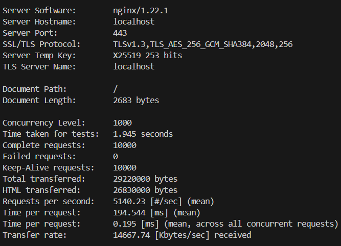

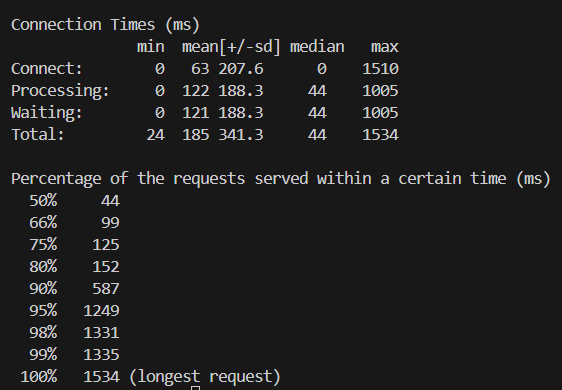

OPINION:

Los resultados de esta prueba muestran una mejora significativa en el rendimiento del servidor respecto a la prueba anterior, aunque todavía hay áreas a mejorar.

El servidor ha completado 10,000 solicitudes sin fallos, con un notable aumento en el número de solicitudes procesadas por segundo (521.40), lo que refleja una mejora en la capacidad de manejar carga concurrente. El tiempo promedio por solicitud también ha disminuido considerablemente a 597 ms, lo que es un buen indicio de una respuesta más rápida.

Aunque los tiempos de conexión y procesamiento han mejorado, aún se observan picos elevados, especialmente en los tiempos de respuesta, donde algunas solicitudes tardan hasta 16 segundos en completarse. Estos picos sugieren que, bajo ciertas condiciones, el servidor podría enfrentar cuellos de botella, especialmente en la conexión o en las tareas de backend como consultas a bases de datos.

En resumen, aunque el rendimiento general ha mejorado, la gestión de los picos en los tiempos de respuesta y la optimización de la infraestructura de red y backend seguirán siendo claves para mejorar la eficiencia del servidor bajo cargas altas.

## Pruebas logo.png 1000 100 - 1000 1000 y 10000 1000

1. logo.png 1000 100

con el comando

```
ab -n 1000 -c 100 -k -H "Accept-Encoding: gzip, deflate" https://localhost/logo.png

```


OPINION:

Los resultados de esta prueba de rendimiento muestran un rendimiento notablemente bajo en comparación con las pruebas anteriores. A pesar de que no hubo fallos, el servidor está procesando solicitudes muy lentamente. Los tiempos de conexión y procesamiento son extremadamente altos, y la tasa de transferencia es muy baja. Además, todas las solicitudes generaron respuestas de error, probablemente debido a un problema con la configuración del archivo solicitado (/logo.png).

Es claro que el servidor está experimentando cuellos de botella tanto en la conexión como en el procesamiento de las solicitudes, lo que se refleja en los tiempos de respuesta de hasta 82 segundos en el peor caso. Esto sugiere que puede haber problemas con la disponibilidad del archivo solicitado, la configuración del servidor o la forma en que se gestionan los archivos estáticos.

Se recomienda revisar la disponibilidad del archivo, optimizar la configuración del servidor (especialmente para servir archivos estáticos) y monitorear el rendimiento para identificar cuellos de botella en la red o los recursos del servidor. En resumen, el servidor necesita una revisión profunda para mejorar su rendimiento y estabilidad.

2. logo.png 1000 1000

con el comando

```
ab -n 1000 -c 1000 -k -H "Accept-Encoding: gzip, deflate" https://localhost/logo.png

```


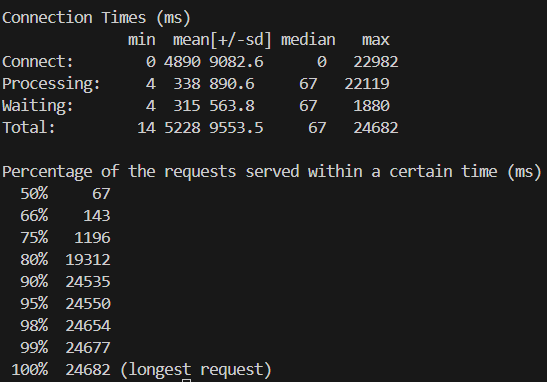

OPINION:

Los resultados muestran una mejora en comparación con las pruebas anteriores, pero siguen existiendo áreas problemáticas. El servidor procesó 1,000 solicitudes sin fallos, lo cual es positivo, pero todas las respuestas fueron no 2xx, sugiriendo que el archivo solicitado (/logo.png) no está disponible o bien configurado. Aunque la tasa de solicitudes por segundo ha aumentado (40.14) y los tiempos de respuesta se han reducido, todavía hay picos altos en algunos casos, lo que indica posibles cuellos de botella o problemas con la infraestructura del servidor. En general, el rendimiento ha mejorado, pero la variabilidad en los tiempos de respuesta y los errores con el archivo solicitado son áreas clave que deben ser abordadas para optimizar aún más el servidor.

3. logo.png 10000 1000

con el comando

```
ab -n 10000 -c 1000 -k -H "Accept-Encoding: gzip, deflate" https://localhost/logo.png

```


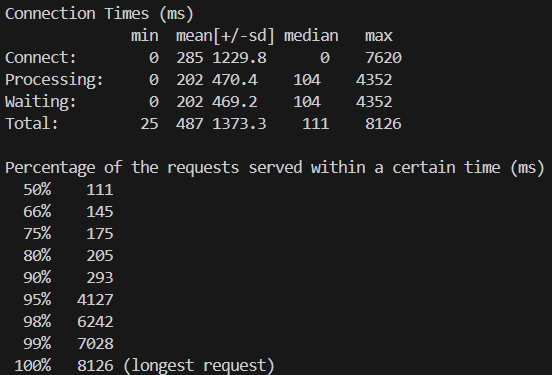

OPINION:

Los resultados muestran una mejora significativa en el rendimiento del servidor, especialmente en términos de solicitudes por segundo y tasa de transferencia. Sin embargo, aún persisten algunas áreas de mejora que necesitan atención.

Primero, es positivo que todas las solicitudes se hayan completado sin fallos, pero el problema con las respuestas no 2xx sigue sin resolverse, ya que el archivo solicitado (/logo.png) no se está sirviendo correctamente, lo que debería investigarse de inmediato. En cuanto a la capacidad de manejo de solicitudes, el servidor ha mejorado, alcanzando 1,020 solicitudes por segundo y reduciendo el tiempo por solicitud a alrededor de un segundo, lo que es bastante bueno.

No obstante, hay ciertos picos en los tiempos de conexión y procesamiento (hasta 7,620 ms), lo que indica que podrían haber cuellos de botella en la infraestructura o la red, especialmente bajo carga. La variabilidad en los tiempos de respuesta también es preocupante, con algunas solicitudes que experimentan tiempos mucho más largos de lo esperado, lo que podría afectar la experiencia del usuario si estos picos son frecuentes.

En resumen, aunque los tiempos de respuesta han mejorado considerablemente, la optimización del servidor sigue siendo necesaria, especialmente en cuanto a la disponibilidad de archivos y la gestión de picos de tráfico.

## Pruebas admin 1000 100 - 1000 1000 y 10000 1000

1. admin 1000 100

con el comando

```
ab -n 1000 -c 100 -k -H "Accept-Encoding: gzip, deflate" https://localhost/admin

```


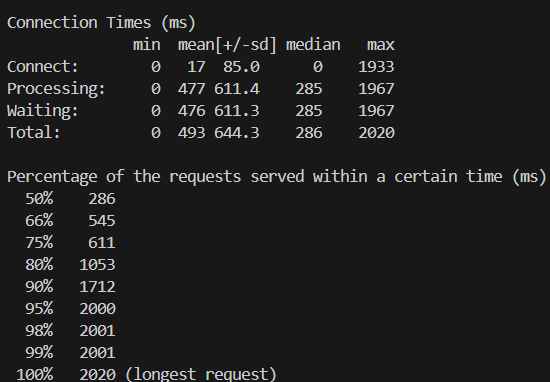

OPINION:

Los resultados muestran que el servidor está funcionando bien en términos generales, con 1,000 solicitudes completadas sin fallos, pero presenta áreas para mejorar. A pesar de procesar un número adecuado de solicitudes por segundo (163), los tiempos de respuesta son elevados, especialmente con un tiempo promedio de 611 ms por solicitud. Esto indica que el servidor está trabajando más lentamente de lo esperado en la ruta /admin, lo que podría estar relacionado con problemas de configuración o de autenticación, ya que las respuestas no son 2xx (lo que sugiere que hay restricciones de acceso).

La alta variabilidad en los tiempos de respuesta, con picos que llegan hasta 2,020 ms, sugiere posibles cuellos de botella, tanto en el procesamiento de las solicitudes como en la espera por recursos del servidor. A pesar de la baja latencia en las conexiones iniciales (17 ms), algunos picos de hasta 1,933 ms en la conexión podrían estar señalando problemas puntuales.

Para mejorar, se recomienda revisar la configuración de la ruta /admin, optimizar el servidor para manejar mejor las solicitudes concurrentes y verificar los procesos de backend si están causando demoras. Además, sería útil realizar más pruebas de carga para evaluar el comportamiento del servidor bajo mayor volumen de tráfico.

2. admin 1000 1000

con el comando

```
ab -n 1000 -c 1000 -k -H "Accept-Encoding: gzip, deflate" https://localhost/admin

```

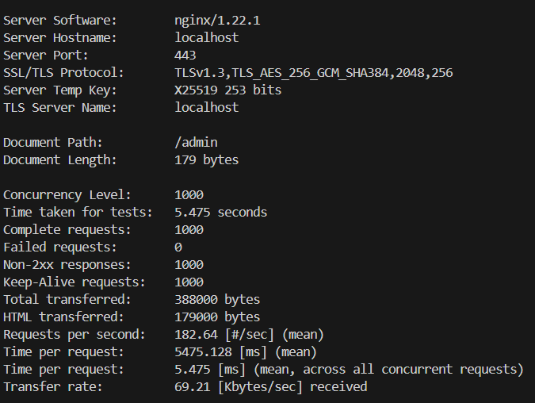

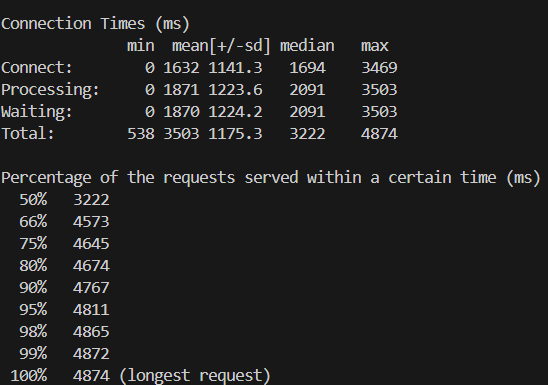

OPINION:

Los resultados de la prueba de carga muestran que el servidor nginx está funcionando correctamente en cuanto a estabilidad, ya que completó 1,000 solicitudes sin fallos. Sin embargo, hay varios puntos a mejorar. Todas las respuestas fueron no 2xx, lo que sugiere posibles problemas en el recurso /admin o en su configuración.

El rendimiento no es excelente: el servidor maneja 182 solicitudes por segundo, pero el tiempo medio de respuesta por solicitud es demasiado alto (más de 5 segundos), lo que indica cuellos de botella en el servidor. Además, los tiempos de conexión y procesamiento son elevados, con picos de hasta 3.5 segundos. Aunque la tasa de transferencia es aceptable, podría optimizarse.

Los tiempos de respuesta muestran una gran variabilidad, y algunas solicitudes experimentan retrasos significativos (casi 5 segundos), lo que podría afectar la experiencia del usuario.

En resumen, el servidor necesita mejoras en la optimización de su configuración y recursos, así como revisar el acceso a /admin. Es recomendable monitorear más a fondo el rendimiento bajo carga y ajustar la infraestructura si es necesario.

3. admin 10000 1000

con el comando

```
ab -n 10000 -c 1000 -k -H "Accept-Encoding: gzip, deflate" https://localhost/admin

```

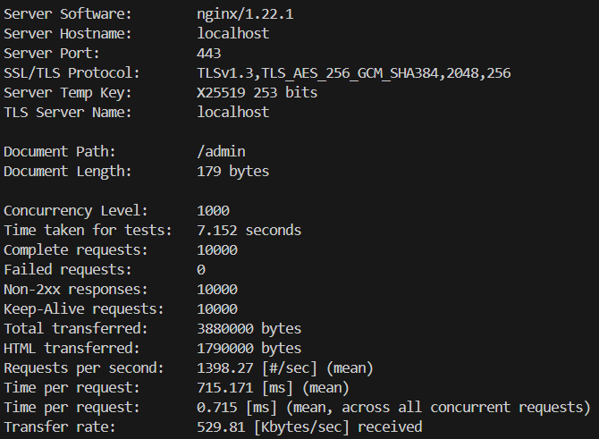

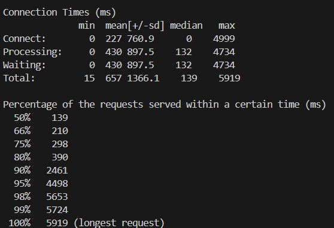

OPINION:

El servidor nginx manejó correctamente 10,000 solicitudes de 1,000 usuarios simultáneos sin fallos, alcanzando un rendimiento alto de 1,398 solicitudes por segundo. Sin embargo, todas las respuestas fueron no 2xx (posiblemente 404 o 301), lo cual sugiere un problema con el recurso solicitado (/admin), que puede estar mal configurado o no disponible.

Aunque el tiempo medio por solicitud es aceptable (715 ms), hubo una gran variabilidad en los tiempos de respuesta. El 10% de las solicitudes tardaron más de 2 segundos, algunas incluso más de 5 segundos, lo que indica cuellos de botella en el servidor bajo alta carga.

En conclusión, el servidor cumplió con la carga esperada, pero se necesita investigar la causa de las respuestas no 2xx y optimizar la configuración para reducir los tiempos de respuesta, especialmente en condiciones de alta concurrencia.

# Despliegue

El despliegue del servidor se realizó utilizando Docker y Vagrant. Para la configuración del servidor, se utilizó Nginx como servidor web y Uptime Kuma para monitoreo en principio, pero luego fue a la opción dificil de Netdata.

Es posible que a la hora de corregir de práctica si no es presencial no vaya bien porque lo hago todo desde consola y al parar la máquina se pierde todo, por lo que es mejor que se haga desde consola. No saco los archivos, los modifico y los vuelvo a subir a la máquina como en otras prácticas.

